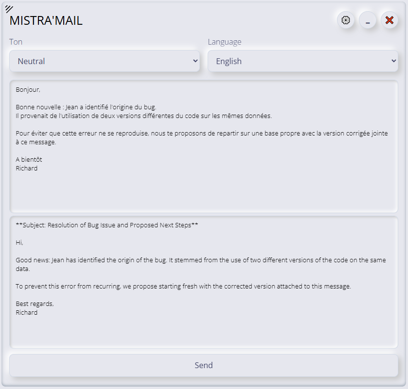

# Mistra'Mail Rewriter Extension

  

**Mistra'Mail Rewriter** is a browser extension designed to **correct**, **rephrase**, or **translate** emails using the [Mistral AI](https://mistral.ai) API.

✅ Tested on **Chrome**, **Firefox**, and **Brave**.

---

## 🔧 Installation (Chrome)

1. Clone or download this repository.
2. Open Chrome and go to `chrome://extensions/`.
3. Enable **Developer mode** (toggle at the top right).
4. Click on **"Load unpacked"** and select the directory of the project.

> ℹ️ The current `manifest.json` is designed for **Chrome**.
> If you're using **Firefox**, replace it with the content from `manifest_firefox.json`.

---

## 🔑 API Key Requirement

This extension uses the **Mistral API**, which requires an API key:

1. Create a free account at [https://mistral.ai](https://mistral.ai)
   (*Phone number verification is required*).
2. Go to your **Account Settings** → **API Keys** section.
3. Generate a new key and copy it.
4. Open the extension **Options page** and paste your key into the appropriate field.

---

## 🚀 Usage

There are two ways to use the extension:

* **Right-click method**:
  Select any email or text → Right-click → Choose **"Open Mistra'Mail"**.

* **Popup method**:
  Click on the extension icon → Click **App** → Use the interface.